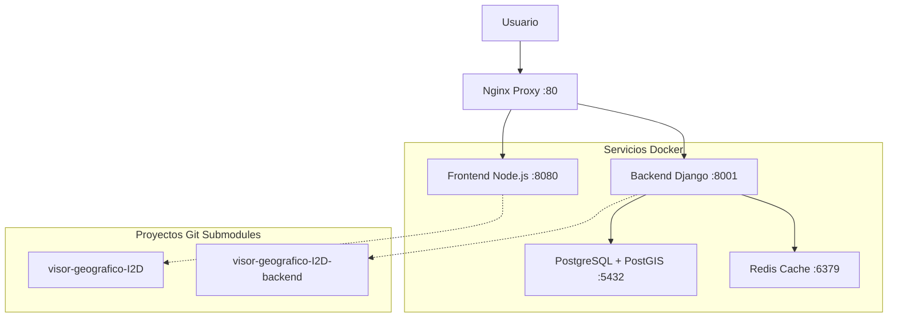

# Visor-I2D: Unified Development Environment
## 🌱 Geographic Information System for Biodiversity Data

[](https://docs.docker.com/compose/)
[](https://www.postgresql.org/)
[](https://www.djangoproject.com/)
[](https://nodejs.org/)
[](LICENSE.md)

**Desarrollado por el [Instituto Alexander von Humboldt Colombia](http://www.humboldt.org.co)**
*Programa de Evaluación y Monitoreo de la Biodiversidad*

---

## 📋 Descripción del Proyecto

El **Visor-I2D** es un sistema de información geográfica unificado que permite la visualización, análisis y gestión de datos de biodiversidad. Este repositorio contiene un entorno de desarrollo completo con Docker Compose que integra tanto el frontend como el backend del proyecto.

### 🎯 Características Principales

- **🗺️ Visualización Geográfica**: Mapas interactivos con OpenLayers para datos de biodiversidad
- **📊 Análisis de Datos**: Herramientas de visualización con AmCharts
- **🔍 Búsqueda Avanzada**: Filtros y consultas sobre registros biológicos
- **📱 Diseño Responsivo**: Interfaz adaptable a diferentes dispositivos
- **🔒 Gestión de Usuarios**: Sistema de autenticación y permisos
- **🌐 APIs REST**: Servicios web para integración con otros sistemas

---

## 🏗️ Arquitectura del Sistema



### 🔧 Stack Tecnológico

#### Frontend
- **Framework**: Vanilla JavaScript + jQuery 3.5.1
- **UI**: Bootstrap 4.5.3 + SCSS
- **Mapas**: OpenLayers 6.5.0
- **Gráficos**: AmCharts 4.10.15
- **Build**: Parcel 1.12.4
- **Servidor**: Apache HTTP Server

#### Backend
- **Lenguaje**: Python 3.9.2
- **Framework**: Django 3.1.7 + Django REST Framework 3.12.2
- **Base de Datos**: PostgreSQL 16 + PostGIS
- **Servidor**: Gunicorn + Nginx
- **Cache**: Redis 7

#### Infraestructura
- **Contenedores**: Docker + Docker Compose
- **Proxy**: Nginx con configuración de seguridad
- **Monitoreo**: Health checks y logs estructurados

---

## 📁 Estructura del Proyecto

```
humboldt/                                    # 📂 Repositorio principal
├── 📄 README.md                            # Este archivo
├── 📄 .gitignore                           # Exclusiones de Git
├── 📄 .gitmodules                          # Configuración de submódulos
├── 📄 docker-compose.yml                   # Orquestación de servicios
├──
├── 📚 Documentación/
│   ├── 📄 DOCKER_SETUP_README.md          # Guía completa de Docker (620 líneas)
│   ├── 📄 GIT_SETUP_README.md             # Guía de configuración Git
│   ├── 📄 LEARNING_PLAN.md                # Plan de aprendizaje (18 semanas)
│   └── 📄 UPGRADE_STRATEGY.md             # Estrategia de modernización
├──
├── 🛠️ scripts/                            # Scripts de gestión
│   ├── 📄 git-setup.sh                    # Gestión de Git y submódulos
│   ├── 📄 db-setup.sh                     # Gestión de base de datos
│   └── 📄 init-db.sql                     # Inicialización de PostgreSQL
├──
├── 🌐 nginx/                              # Configuración Nginx
│   ├── 📄 nginx.conf                      # Configuración principal
│   └── 📄 default.conf                    # Configuración del servidor
├──
├── 💾 backups/                            # Respaldos de base de datos
│   └── 📄 .gitkeep                        # Preservar directorio
├──
├── 📋 logs/                               # Logs de aplicación
│   └── 📄 .gitkeep                        # Preservar directorio
├──
├── 🎨 visor-geografico-I2D/               # Frontend (Git Submodule)
│   ├── 📁 src/                           # Código fuente frontend
│   ├── 📄 package.json                   # Dependencias Node.js
│   ├── 📄 Dockerfile                     # Contenedor frontend
│   └── 📄 README.md                      # Documentación frontend
└──
└── 🐍 visor-geografico-I2D-backend/       # Backend (Git Submodule)
    ├── 📁 applications/                  # Aplicaciones Django
    ├── 📁 i2dbackend/                   # Configuración Django
    ├── 📄 requirements.txt              # Dependencias Python
    ├── 📄 Dockerfile                    # Contenedor backend
    └── 📄 README.md                     # Documentación backend
```

---

## 🚀 Configuración Rápida

### 📋 Prerrequisitos

- **Docker** (versión 20.0+)
- **Docker Compose** (versión 2.0+)
- **Git** (versión 2.20+)
- **4GB RAM mínimo** (8GB recomendado)

### ⚡ Instalación en 3 Pasos

```bash
# 1️⃣ Clonar el repositorio con submódulos
git clone --recurse-submodules https://github.com/maccevedor/humboldt.git
cd humboldt

# 2️⃣ Configurar Git y permisos
chmod +x scripts/*.sh
./scripts/git-setup.sh init

# 3️⃣ Iniciar el entorno completo
docker-compose up -d
./scripts/db-setup.sh setup
```

### ✅ Verificación

```bash
# Verificar servicios
docker-compose ps

# Verificar aplicaciones
curl http://localhost/health          # ✅ Nginx
curl http://localhost:8001/admin/     # ✅ Backend
curl http://localhost:8080/           # ✅ Frontend

# Verificar API GBIF
curl http://localhost:8001/api/gbif/gbifinfo  # ✅ GBIF API

# Verificar archivos estáticos del admin
curl -I http://localhost:8001/static/admin/css/base.css  # ✅ Admin CSS
```

---

## 🔧 Gestión del Proyecto

### 📦 Scripts de Gestión

#### Git y Submódulos
```bash
./scripts/git-setup.sh init        # Configurar submódulos
./scripts/git-setup.sh update      # Actualizar submódulos
./scripts/git-setup.sh status      # Estado del repositorio
./scripts/git-setup.sh verify      # Verificar configuración
```

#### Base de Datos
```bash
./scripts/db-setup.sh setup        # Configuración completa
./scripts/db-setup.sh migrate      # Solo migraciones
./scripts/db-setup.sh superuser    # Crear superusuario
./scripts/db-setup.sh backup       # Crear respaldo
./scripts/db-setup.sh status       # Estado de la BD
```

### 🐳 Docker Compose

#### Servicios Principales
```bash
# Iniciar todos los servicios
docker-compose up -d

# Ver logs en tiempo real
docker-compose logs -f

# Reiniciar servicio específico
docker-compose restart backend

# Parar todos los servicios
docker-compose down
```

#### Comandos de Desarrollo
```bash
# Entrar al contenedor backend
docker exec -it visor_i2d_backend bash

# Entrar al contenedor frontend
docker exec -it visor_i2d_frontend bash

# Ejecutar comandos Django
docker exec -it visor_i2d_backend python manage.py shell
docker exec -it visor_i2d_backend python manage.py createsuperuser
```

---

## 🌐 Puntos de Acceso

### 🖥️ Interfaces Web
| Servicio | URL | Descripción |
|----------|-----|-------------|
| **Aplicación Principal** | http://localhost | Visor geográfico completo |
| **Administración Django** | http://localhost/admin/ | Panel de administración |
| **Frontend Directo** | http://localhost:8080 | Aplicación frontend |
| **Backend Directo** | http://localhost:8001 | API REST |

### 🔑 Credenciales Django Admin
- **URL**: `http://localhost:8001/admin/`
- **Usuario**: `admin`
- **Email**: `admin@example.com`
- **Contraseña**: `admin123`

> **Nota de Seguridad**: Para uso en producción, cambia estas credenciales por defecto y usa contraseñas más seguras.

#### 🔄 Resetear Contraseña de Admin

Si necesitas resetear la contraseña del administrador Django:

```bash
# Método 1: Usando Django management command
docker exec -it visor_i2d_backend python manage.py changepassword admin

# Método 2: Usando Django shell
docker exec -i visor_i2d_backend python manage.py shell -c "from django.contrib.auth.models import User; u = User.objects.get(username='admin'); u.set_password('nueva_contraseña'); u.save(); print('Password updated successfully')"

# Método 3: Crear nuevo superusuario
docker exec -it visor_i2d_backend python manage.py createsuperuser
```

#### 🆕 Crear Usuario Admin (si no existe)

Si no hay usuarios administradores en el sistema:

```bash
# Crear superusuario automáticamente
docker exec -i visor_i2d_backend python manage.py createsuperuser --noinput --username admin --email admin@example.com

# Establecer contraseña
docker exec -i visor_i2d_backend python manage.py shell -c "from django.contrib.auth.models import User; u = User.objects.get(username='admin'); u.set_password('admin123'); u.save(); print('Admin user created successfully')"
```

### 📡 APIs y Endpoints
| Endpoint | Descripción |
|----------|-------------|
| `/api/` | API REST principal |
| `/health` | Health check |
| `/static/` | Archivos estáticos |
| `/media/` | Archivos multimedia |

### 💾 Base de Datos
```bash
# Conexión directa
docker exec -it visor_i2d_db psql -U i2d_user -d i2d_db

# Conexión externa
psql -h localhost -p 5432 -U i2d_user -d i2d_db
```

#### 🗂️ Esquemas de Base de Datos
El sistema utiliza múltiples esquemas PostgreSQL para organizar los datos:

| Esquema | Propósito | Descripción |
|---------|-----------|-------------|
| `django` | Framework | Tablas de Django (usuarios, sesiones, etc.) |
| `gbif_consultas` | GBIF | Datos de consultas GBIF y metadatos |
| `capas_base` | GIS | Capas geográficas base |
| `geovisor` | Aplicación | Datos específicos del geovisor |

#### 🌐 Endpoints GBIF
| Endpoint | Método | Descripción |
|----------|--------|-------------|
| `/api/gbif/gbifinfo` | GET | Información de descargas GBIF |

> **Nota**: La tabla `gbif_info` debe crearse manualmente ya que el modelo está marcado como `managed = False`.

---

## 📚 Documentación Detallada

### 📖 Guías Disponibles

1. **[DOCKER_SETUP_README.md](DOCKER_SETUP_README.md)** (620 líneas)
   - Configuración completa de Docker
   - Arquitectura detallada
   - Troubleshooting exhaustivo
   - Comandos de gestión

2. **[GIT_SETUP_README.md](GIT_SETUP_README.md)**
   - Configuración de Git y submódulos
   - Resolución de conflictos
   - Workflow de desarrollo

3. **[LEARNING_PLAN.md](LEARNING_PLAN.md)** (18 semanas)
   - Plan de aprendizaje completo
   - 8 fases de tecnologías
   - Ejercicios prácticos
   - Proyectos de consolidación

4. **[UPGRADE_STRATEGY.md](UPGRADE_STRATEGY.md)**
   - Estrategia de modernización
   - Análisis de tecnologías
   - Plan de migración en 5 fases
   - Nuevas funcionalidades propuestas

### 🎯 Orden de Lectura Recomendado

Para **nuevos desarrolladores**:
1. Este README (configuración básica)
2. `GIT_SETUP_README.md` (configuración Git)
3. `DOCKER_SETUP_README.md` (configuración Docker)
4. `LEARNING_PLAN.md` (aprendizaje de tecnologías)

Para **administradores de sistema**:
1. Este README (visión general)
2. `DOCKER_SETUP_README.md` (configuración completa)
3. `UPGRADE_STRATEGY.md` (planificación)

Para **planificación de proyecto**:
1. `UPGRADE_STRATEGY.md` (estrategia de modernización)
2. `LEARNING_PLAN.md` (capacitación del equipo)

---

## 🔍 Desarrollo y Testing

### 🛠️ Workflow de Desarrollo

1. **Configuración inicial**:
   ```bash
   git clone --recurse-submodules https://github.com/maccevedor/humboldt.git
   cd humboldt
   ./scripts/git-setup.sh init
   ```

2. **Desarrollo en submódulos**:
   ```bash
   cd visor-geografico-I2D          # Frontend
   # Hacer cambios, commit, push

   cd ../visor-geografico-I2D-backend  # Backend
   # Hacer cambios, commit, push
   ```

3. **Actualizar repositorio principal**:
   ```bash
   git add visor-geografico-I2D visor-geografico-I2D-backend
   git commit -m "Update submodules"
   git push
   ```

### 🧪 Testing

```bash
# Backend tests
docker exec -it visor_i2d_backend python manage.py test

# Frontend tests (si están configurados)
docker exec -it visor_i2d_frontend npm test

# Health checks
curl http://localhost/health
```

---

## 🐛 Troubleshooting

> **🔧 Actualizaciones Recientes**: Se han corregido problemas relacionados con la tabla `gbif_info` faltante y la creación de usuarios administradores. Ver secciones específicas abajo.

### ❗ Problemas Comunes

#### Servicios no inician
```bash
# Verificar Docker
docker --version
sudo systemctl status docker

# Verificar puertos
netstat -tlnp | grep :80
netstat -tlnp | grep :5432
```

#### Problemas de submódulos
```bash
# Limpiar y reinicializar
./scripts/git-setup.sh clean
./scripts/git-setup.sh init
```

#### Problemas de base de datos
```bash
# Verificar estado
./scripts/db-setup.sh status

# Reiniciar base de datos
docker-compose restart db
./scripts/db-setup.sh migrate
```

#### Error "relation 'gbif_info' does not exist"
Si encuentras el error `ProgrammingError: relation "gbif_info" does not exist`, necesitas crear la tabla manualmente:

```bash
# Crear tabla gbif_info en el esquema correcto
docker exec visor_i2d_db psql -U i2d_user -d i2d_db -c "CREATE TABLE IF NOT EXISTS gbif_consultas.gbif_info (id SERIAL PRIMARY KEY, download_date DATE NOT NULL, doi TEXT);"

# Verificar que la tabla fue creada
docker exec visor_i2d_db psql -U i2d_user -d i2d_db -c "SELECT table_name FROM information_schema.tables WHERE table_schema = 'gbif_consultas' AND table_name = 'gbif_info';"
```

#### Crear usuario administrador
Si no puedes acceder al panel de administración Django:

```bash
# Crear superusuario usando el script
./db-setup.sh superuser

# O crear manualmente
docker exec visor_i2d_backend python manage.py createsuperuser --username admin --email admin@humboldt.gov.co --noinput
docker exec visor_i2d_backend python manage.py shell -c "from django.contrib.auth import get_user_model; User = get_user_model(); admin = User.objects.get(username='admin'); admin.set_password('admin123'); admin.save(); print('Password set successfully')"
```

#### Error 404 en archivos CSS/JS del admin (static files)
Si el panel de administración aparece sin estilos y con errores 404 en `/static/admin/css/base.css`:

```bash
# Verificar que los archivos estáticos estén recolectados
docker exec visor_i2d_backend python manage.py collectstatic --noinput

# Reiniciar el backend para aplicar cambios en URLs
docker-compose restart backend

# Verificar que los archivos se sirven correctamente
curl -I http://0.0.0.0:8001/static/admin/css/base.css
```

> **Nota**: Este problema se resuelve añadiendo el servicio de archivos estáticos en las URLs de Django para modo desarrollo. El fix ya está aplicado en el código.

#### Error de conectividad GeoServer con PostgreSQL
Si el frontend muestra errores `ERR_SOCKET_NOT_CONNECTED` al cargar capas del mapa o GeoServer no puede conectarse a la base de datos:

**Síntomas:**
- Requests pendientes en el frontend al cargar mapas
- Errores `java.net.SocketTimeoutException: connect timed out` en logs de GeoServer
- Capas del mapa no se cargan correctamente
- WMS requests fallan con errores de conexión

**Causas y Soluciones:**

1. **Variables de entorno incorrectas en GeoServer:**
```yaml
# En docker-compose.yml, asegurar que GeoServer use:
environment:
  - HOST=db  # NO usar DB_HOST
  - POSTGRES_PORT=5432
  - POSTGRES_DB=i2d_db
  - POSTGRES_USER=i2d_user
  - POSTGRES_PASS=i2d_password
```

2. **Dependencias de servicios faltantes:**
```yaml
# GeoServer debe esperar a que la base de datos esté lista:
geoserver:
  depends_on:
    db:
      condition: service_healthy
```

3. **Configuración de datastores desactualizada:**
Los datastores existentes en `./datosgs/workspaces/*/datastore.xml` pueden tener parámetros de conexión obsoletos.

**Para actualizar datastores:**
```xml
<!-- En cada archivo datastore.xml, actualizar: -->
<entry key="host">db</entry>
<entry key="port">5432</entry>
<entry key="database">i2d_db</entry>
<entry key="user">i2d_user</entry>
<entry key="passwd">i2d_password</entry>
<entry key="dbtype">postgis</entry>
<entry key="schema">public</entry>
```

**Datastores que requieren actualización:**
- `datosgs/workspaces/Capas_Base/Capas_Base/datastore.xml`
- `datosgs/workspaces/ecoreservas/*/datastore.xml`
- `datosgs/workspaces/gbif/*/datastore.xml`
- Otros workspaces según sea necesario

**Verificación:**
```bash
# Reiniciar servicios después de cambios
docker-compose down
docker-compose up -d

# Verificar logs de GeoServer
docker-compose logs -f geoserver

# Probar acceso a GeoServer
curl -I http://localhost:8081/geoserver/

# Verificar WMS endpoints
curl "http://localhost:8081/geoserver/Capas_Base/wms?SERVICE=WMS&VERSION=1.3.0&REQUEST=GetCapabilities"
```

#### Errores de proyección en GeoServer (Advertencias normales)
Si ves advertencias como `"Popular Visualisation Pseudo Mercator" projection outside its valid area`:

- **Estas son advertencias normales** que no afectan la funcionalidad
- Ocurren cuando las proyecciones de mapa se usan fuera de su área geográfica válida
- **No requieren acción** - el sistema funciona correctamente

### 🆘 Comandos de Emergencia

```bash
# Parar todo
docker-compose down

# Limpiar completamente
docker-compose down -v --remove-orphans
docker system prune -a

# Empezar desde cero
git submodule update --init --recursive
docker-compose up -d
./scripts/db-setup.sh setup
```

---

## � Troubleshooting GeoServer

### ❗ Problemas Comunes

#### Error de conectividad GeoServer con PostgreSQL
Si el frontend muestra errores `ERR_SOCKET_NOT_CONNECTED` al cargar capas del mapa o GeoServer no puede conectarse a la base de datos:

**Síntomas:**
- Requests pendientes en el frontend al cargar mapas
- Errores `java.net.SocketTimeoutException: connect timed out` en logs de GeoServer
- Capas del mapa no se cargan correctamente
- WMS requests fallan con errores de conexión

**Causas y Soluciones:**

1. **Variables de entorno incorrectas en GeoServer:**
```yaml
# En docker-compose.yml, asegurar que GeoServer use:
environment:
  - HOST=db  # NO usar DB_HOST
  - POSTGRES_PORT=5432
  - POSTGRES_DB=i2d_db
  - POSTGRES_USER=i2d_user
  - POSTGRES_PASS=i2d_password
```

2. **Dependencias de servicios faltantes:**
```yaml
# GeoServer debe esperar a que la base de datos esté lista:
geoserver:
  depends_on:
    db:
      condition: service_healthy
```

3. **Configuración de datastores desactualizada:**
Los datastores existentes en `./datosgs/workspaces/*/datastore.xml` pueden tener parámetros de conexión obsoletos.

**Para actualizar datastores:**
```xml
<!-- En cada archivo datastore.xml, actualizar: -->
<entry key="host">db</entry>
<entry key="port">5432</entry>
<entry key="database">i2d_db</entry>
<entry key="user">i2d_user</entry>
<entry key="passwd">i2d_password</entry>
<entry key="dbtype">postgis</entry>
<entry key="schema">public</entry>
```

**Datastores que requieren actualización:**
- `datosgs/workspaces/Capas_Base/Capas_Base/datastore.xml`
- `datosgs/workspaces/ecoreservas/*/datastore.xml`
- `datosgs/workspaces/gbif/*/datastore.xml`
- Otros workspaces según sea necesario

**Verificación:**
```bash
# Reiniciar servicios después de cambios
docker-compose down
docker-compose up -d

# Verificar logs de GeoServer
docker-compose logs -f geoserver

# Probar acceso a GeoServer
curl -I http://localhost:8081/geoserver/

# Verificar WMS endpoints
curl "http://localhost:8081/geoserver/Capas_Base/wms?SERVICE=WMS&VERSION=1.3.0&REQUEST=GetCapabilities"
```

#### Errores de proyección en GeoServer (Advertencias normales)
Si ves advertencias como `"Popular Visualisation Pseudo Mercator" projection outside its valid area`:

- **Estas son advertencias normales** que no afectan la funcionalidad
- Ocurren cuando las proyecciones de mapa se usan fuera de su área geográfica válida
- **No requieren acción** - el sistema funciona correctamente

#### Error de configuración de entorno en desarrollo (Frontend)
Si el frontend muestra errores `ERR_NAME_NOT_RESOLVED` intentando conectar a servidores de prueba inexistentes como `test-geoserver.humboldt.org.co`:

**Síntomas:**
- Console logs muestran errores `Failed to load resource: net::ERR_NAME_NOT_RESOLVED`
- Requests a URLs como `https://test-geoserver.humboldt.org.co/geoserver/`
- Capas del mapa no cargan desde el GeoServer local
- Frontend intenta conectar a servidores de prueba en lugar del entorno local

**Causa:**
El `DockerfileDev` estaba configurado para usar siempre el archivo `.env.test` en lugar del archivo `.env` personalizado del desarrollador.

**Solución aplicada:**
1. **Actualizar DockerfileDev** para usar el archivo `.env` personalizado:
   ```dockerfile
   # Antes (problemático):
   COPY .env.test /home/node/app/.env
   CMD ["npm", "run", "dev:test"]
   
   # Después (corregido):
   COPY .env /home/node/app/.env
   CMD ["npm", "run", "dev"]
   ```

2. **Configurar el archivo `.env` para desarrollo local:**
   ```bash
   NODE_ENV=development
   GEOSERVER_URL=http://localhost:8081/geoserver/
   PYTHONSERVER=http://localhost:8001/
   ```

3. **Reconstruir y reiniciar el contenedor frontend:**
   ```bash
   docker-compose build frontend
   docker-compose down && docker-compose up -d
   ```

**Verificación:**
```bash
# Verificar que el frontend usa el comando correcto
docker logs visor_i2d_frontend --tail 5
# Debe mostrar: "npm run dev" (no "npm run dev:test")

# Verificar que las URLs apuntan al entorno local
curl http://localhost:1234/
# El frontend debe cargar mapas desde localhost:8081
```

**Nota importante:** Este fix asegura que el entorno de desarrollo use las configuraciones locales en lugar de los servidores de prueba remotos, permitiendo el desarrollo completamente offline.

#### Problemas con el login

Si no puedes acceder al panel de administración del geoserver:

```bash
# Stop GeoServer container
docker-compose stop geoserver

# Backup current security configuration
cp -r ./datosgs/security ./datosgs/security.backup

# Remove the existing security configuration to force reset
rm -rf ./datosgs/security

# Start GeoServer - it will create new security with your environment password
docker-compose up -d geoserver

# Wait for GeoServer to fully start (check logs)
docker-compose logs -f geoserver
```

---

## 📚 Documentación Detallada

### 📖 Guías Disponibles

1. **[DOCKER_SETUP_README.md](DOCKER_SETUP_README.md)** (620 líneas)
   - Configuración completa de Docker
   - Arquitectura detallada
   - Troubleshooting exhaustivo
   - Comandos de gestión

2. **[GIT_SETUP_README.md](GIT_SETUP_README.md)**
   - Configuración de Git y submódulos
   - Resolución de conflictos
   - Workflow de desarrollo

3. **[LEARNING_PLAN.md](LEARNING_PLAN.md)** (18 semanas)
   - Plan de aprendizaje completo
   - 8 fases de tecnologías
   - Ejercicios prácticos
   - Proyectos de consolidación

4. **[UPGRADE_STRATEGY.md](UPGRADE_STRATEGY.md)**
   - Estrategia de modernización
   - Análisis de tecnologías
   - Plan de migración en 5 fases
   - Nuevas funcionalidades propuestas

### 🎯 Orden de Lectura Recomendado

Para **nuevos desarrolladores**:
1. Este README (configuración básica)
2. `GIT_SETUP_README.md` (configuración Git)
3. `DOCKER_SETUP_README.md` (configuración Docker)
4. `LEARNING_PLAN.md` (aprendizaje de tecnologías)

Para **administradores de sistema**:
1. Este README (visión general)
2. `DOCKER_SETUP_README.md` (configuración completa)
3. `UPGRADE_STRATEGY.md` (planificación)

Para **planificación de proyecto**:
1. `UPGRADE_STRATEGY.md` (estrategia de modernización)
2. `LEARNING_PLAN.md` (capacitación del equipo)

---

## 🔍 Desarrollo y Testing

### 🛠️ Workflow de Desarrollo

1. **Configuración inicial**:
   ```bash
   git clone --recurse-submodules https://github.com/maccevedor/humboldt.git
   cd humboldt
   ./scripts/git-setup.sh init
   ```

2. **Desarrollo en submódulos**:
   ```bash
   cd visor-geografico-I2D          # Frontend
   # Hacer cambios, commit, push

   cd ../visor-geografico-I2D-backend  # Backend
   # Hacer cambios, commit, push
   ```

3. **Actualizar repositorio principal**:
   ```bash
   git add visor-geografico-I2D visor-geografico-I2D-backend
   git commit -m "Update submodules"
   git push
   ```

### 🧪 Testing

```bash
# Backend tests
docker exec -it visor_i2d_backend python manage.py test

# Frontend tests (si están configurados)
docker exec -it visor_i2d_frontend npm test

# Health checks
curl http://localhost/health
```

---

## 📈 Roadmap y Modernización

### 📈 Estado Actual del Sistema

#### ✅ **SISTEMA COMPLETAMENTE FUNCIONAL**
- **Frontend**: Interfaz completamente operativa con controles de mapa funcionales
- **Backend**: Django 3.1.7 con PostGIS habilitado y APIs REST completas
- **Base de Datos**: PostgreSQL 16 + PostGIS 3.4 con datos completos (8,702 municipios, 297 departamentos)
- **GeoServer**: Integración completa con capas geográficas funcionales
- **Búsqueda**: Sistema de búsqueda de municipios con navegación automática
- **Proyectos**: Sistema dinámico de gestión de proyectos sin necesidad de cambios de código

#### 🔄 **Próximas Mejoras Planificadas**
- **Performance**: Optimización de consultas espaciales identificadas por auditoría
- **UI/UX**: Mejoras de diseño basadas en feedback de usuarios
- **Monitoreo**: Implementación de métricas de rendimiento en tiempo real
- **Backup**: Automatización de respaldos de base de datos
- **Documentación**: Guías de usuario final y administración

Ver **[UPGRADE_STRATEGY.md](UPGRADE_STRATEGY.md)** para detalles completos.

### 🎯 Funcionalidades Planificadas

- 🗺️ Mapas 3D interactivos
- 📱 Progressive Web App (PWA)
- 🔐 Autenticación OAuth2/SSO
- 📊 Dashboards en tiempo real
- 🤖 APIs de machine learning
- 🌐 Integración con servicios externos

---

## 🤝 Contribución

### 👥 Equipo de Desarrollo

- **Julián David Torres Caicedo** - *Frontend Development* - [juliant8805](https://github.com/juliant8805)
- **Liceth Barandica Diaz** - *Frontend Development* - [licethbarandicadiaz](https://github.com/licethbarandicadiaz)
- **Daniel López** - *DevOps and Deployment* - [danflop](https://github.com/danflop)

### 📝 Cómo Contribuir

1. Fork el repositorio
2. Crear rama de feature (`git checkout -b feature/nueva-funcionalidad`)
3. Hacer cambios y commit (`git commit -am 'Add nueva funcionalidad'`)
4. Push a la rama (`git push origin feature/nueva-funcionalidad`)
5. Crear Pull Request

### 📋 Estándares de Código

- **Python**: PEP 8
- **JavaScript**: ESLint
- **Commits**: Conventional Commits
- **Documentación**: Markdown con emojis

---

## 📝 Changelog

### 🔧 Correcciones Recientes (2025-08-28)

#### ✅ Problemas Críticos Resueltos:
- **Sistema de Gestión de Proyectos Dinámico**: Implementación completa con API REST y frontend dinámico
- **Búsqueda de Municipios**: Funcionalidad completa con dropdown interactivo y navegación en mapa
- **Controles de Mapa**: Botones de zoom y extensión completa restaurados y funcionales
- **Errores JavaScript**: Eliminados todos los errores de runtime y referencias nulas
- **Integración GeoServer-PostgreSQL**: Conectividad completa entre servicios
- **Django GIS**: Soporte PostGIS habilitado con GeometryField y operaciones espaciales
- **Autenticación GeoServer**: Procedimientos de reset de credenciales documentados
- **Auditoría de Base de Datos**: Script completo con métricas de rendimiento y consultas optimizadas
- **Variables de Entorno**: Configuración protobuf y entorno de desarrollo corregida
- **Documentación Técnica**: Reportes completos de base de datos y arquitectura del sistema

#### 🚀 Funcionalidades Nuevas Implementadas:

**Sistema de Proyectos Dinámico:**
```bash
# API para gestión de proyectos
curl http://localhost:8001/api/projects/          # Lista todos los proyectos
curl http://localhost:8001/api/projects/HU-VisorI2D-0001/  # Proyecto específico

# Cambio dinámico de proyecto vía URL
http://localhost/?proyecto=HU-VisorI2D-0001
```

**Búsqueda de Municipios:**
```bash
# API de búsqueda implementada
curl http://localhost:8001/api/mpio/search/medellin
```

**Auditoría de Base de Datos:**
```bash
# Script de auditoría completo
cd visor-geografico-I2D-backend/docs/
./database_audit.sh
```

**Verificación de Funcionalidades:**
```bash
# Verificar controles de mapa
curl http://localhost:1234/  # Botones de zoom visibles

# Verificar integración GeoServer
curl "http://localhost:8081/geoserver/Capas_Base/wms?SERVICE=WMS&VERSION=1.3.0&REQUEST=GetCapabilities"
```

#### 🔐 Credenciales del Sistema:

**Django Admin:**
- **Usuario**: `admin`
- **Email**: `admin@humboldt.gov.co`
- **Contraseña**: `admin123`
- **URL**: `http://localhost:8001/admin/`

**GeoServer:**
- **Usuario**: `admin`
- **Contraseña**: `geoserver`
- **URL**: `http://localhost:8081/geoserver/`
- **Reset**: Ver sección troubleshooting para reset de credenciales

**Base de Datos:**
- **Host**: `localhost:5432`
- **Database**: `i2d_db`
- **Usuario**: `i2d_user`
- **Contraseña**: `i2d_password`

---

## 📄 Licencia

Este proyecto está licenciado bajo la Licencia MIT - ver el archivo [LICENSE.md](LICENSE.md) para detalles.

---

## 📞 Soporte y Contacto

### 🏢 Instituto Alexander von Humboldt Colombia
- **Website**: [http://www.humboldt.org.co](http://www.humboldt.org.co)
- **Programa**: Evaluación y Monitoreo de la Biodiversidad
- **Área**: Ingeniería de Datos y Desarrollo

### 🐛 Reportar Issues
- **GitHub Issues**: [Reportar problema](https://github.com/maccevedor/humboldt/issues)
- **Documentación**: Ver guías en este repositorio

### 📚 Recursos Adicionales
- [Django Documentation](https://docs.djangoproject.com/)
- [Docker Compose Documentation](https://docs.docker.com/compose/)
- [OpenLayers Documentation](https://openlayers.org/en/latest/doc/)
- [PostgreSQL + PostGIS Documentation](https://postgis.net/documentation/)

---

<div align="center">

**🌱 Desarrollado con ❤️ para la conservación de la biodiversidad colombiana**

[](http://www.humboldt.org.co)

</div>
