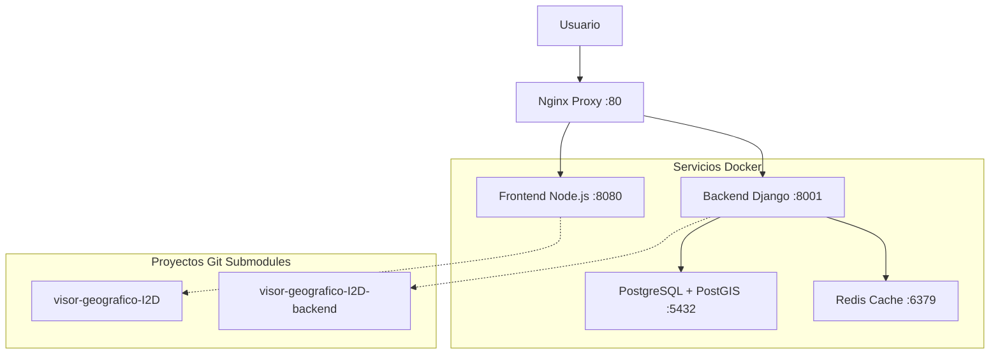

# Visor-I2D: Unified Development Environment
## 🌱 Geographic Information System for Biodiversity Data

[](https://docs.docker.com/compose/)
[](https://www.postgresql.org/)
[](https://www.djangoproject.com/)
[](https://nodejs.org/)
[](LICENSE.md)

**Desarrollado por el [Instituto Alexander von Humboldt Colombia](http://www.humboldt.org.co)**
*Programa de Evaluación y Monitoreo de la Biodiversidad*

---

## 📋 Descripción del Proyecto

El **Visor-I2D** es un sistema de información geográfica unificado que permite la visualización, análisis y gestión de datos de biodiversidad. Este repositorio contiene un entorno de desarrollo completo con Docker Compose que integra tanto el frontend como el backend del proyecto.

### 🎯 Características Principales

- **🗺️ Visualización Geográfica**: Mapas interactivos con OpenLayers para datos de biodiversidad
- **📊 Análisis de Datos**: Herramientas de visualización con AmCharts
- **🔍 Búsqueda Avanzada**: Filtros y consultas sobre registros biológicos
- **📱 Diseño Responsivo**: Interfaz adaptable a diferentes dispositivos
- **🔒 Gestión de Usuarios**: Sistema de autenticación y permisos
- **🌐 APIs REST**: Servicios web para integración con otros sistemas

---

## 🏗️ Arquitectura del Sistema



### 🔧 Stack Tecnológico

#### Frontend
- **Framework**: Vanilla JavaScript + jQuery 3.5.1
- **UI**: Bootstrap 4.5.3 + SCSS
- **Mapas**: OpenLayers 6.5.0
- **Gráficos**: AmCharts 4.10.15
- **Build**: Parcel 1.12.4
- **Servidor**: Apache HTTP Server

#### Backend
- **Lenguaje**: Python 3.9.2
- **Framework**: Django 3.1.7 + Django REST Framework 3.12.2
- **Base de Datos**: PostgreSQL 16 + PostGIS
- **Servidor**: Gunicorn + Nginx
- **Cache**: Redis 7

#### Infraestructura
- **Contenedores**: Docker + Docker Compose
- **Proxy**: Nginx con configuración de seguridad
- **Monitoreo**: Health checks y logs estructurados

---

## 📁 Estructura del Proyecto

```
humboldt/                                    # 📂 Repositorio principal
├── 📄 README.md                            # Este archivo
├── 📄 .gitignore                           # Exclusiones de Git
├── 📄 .gitmodules                          # Configuración de submódulos
├── 📄 docker-compose.yml                   # Orquestación de servicios
├──
├── 📚 Documentación/
│   ├── 📄 DOCKER_SETUP_README.md          # Guía completa de Docker (620 líneas)
│   ├── 📄 GIT_SETUP_README.md             # Guía de configuración Git
│   ├── 📄 LEARNING_PLAN.md                # Plan de aprendizaje (18 semanas)
│   └── 📄 UPGRADE_STRATEGY.md             # Estrategia de modernización
├──
├── 🛠️ scripts/                            # Scripts de gestión
│   ├── 📄 git-setup.sh                    # Gestión de Git y submódulos
│   ├── 📄 db-setup.sh                     # Gestión de base de datos
│   └── 📄 init-db.sql                     # Inicialización de PostgreSQL
├──
├── 🌐 nginx/                              # Configuración Nginx
│   ├── 📄 nginx.conf                      # Configuración principal
│   └── 📄 default.conf                    # Configuración del servidor
├──
├── 💾 backups/                            # Respaldos de base de datos
│   └── 📄 .gitkeep                        # Preservar directorio
├──
├── 📋 logs/                               # Logs de aplicación
│   └── 📄 .gitkeep                        # Preservar directorio
├──
├── 🎨 visor-geografico-I2D/               # Frontend (Git Submodule)
│   ├── 📁 src/                           # Código fuente frontend
│   ├── 📄 package.json                   # Dependencias Node.js
│   ├── 📄 Dockerfile                     # Contenedor frontend
│   └── 📄 README.md                      # Documentación frontend
└──
└── 🐍 visor-geografico-I2D-backend/       # Backend (Git Submodule)
    ├── 📁 applications/                  # Aplicaciones Django
    ├── 📁 i2dbackend/                   # Configuración Django
    ├── 📄 requirements.txt              # Dependencias Python
    ├── 📄 Dockerfile                    # Contenedor backend
    └── 📄 README.md                     # Documentación backend
```

---

## 🚀 Configuración Rápida

### 📋 Prerrequisitos

- **Docker** (versión 20.0+)
- **Docker Compose** (versión 2.0+)
- **Git** (versión 2.20+)
- **4GB RAM mínimo** (8GB recomendado)

### ⚡ Instalación en 3 Pasos

```bash
# 1️⃣ Clonar el repositorio con submódulos
git clone --recurse-submodules https://github.com/maccevedor/humboldt.git
cd humboldt

# 2️⃣ Configurar Git y permisos
chmod +x scripts/*.sh
./scripts/git-setup.sh init

# 3️⃣ Iniciar el entorno completo
docker-compose up -d
./scripts/db-setup.sh setup
```

### ✅ Verificación

```bash
# Verificar servicios
docker-compose ps

# Verificar aplicaciones
curl http://localhost/health          # ✅ Nginx
curl http://localhost:8001/admin/     # ✅ Backend
curl http://localhost:8080/           # ✅ Frontend

# Verificar API GBIF
curl http://localhost:8001/api/gbif/gbifinfo  # ✅ GBIF API

# Verificar archivos estáticos del admin
curl -I http://localhost:8001/static/admin/css/base.css  # ✅ Admin CSS
```

---

## 🔧 Gestión del Proyecto

### 📦 Scripts de Gestión

#### Git y Submódulos
```bash
./scripts/git-setup.sh init        # Configurar submódulos
./scripts/git-setup.sh update      # Actualizar submódulos
./scripts/git-setup.sh status      # Estado del repositorio
./scripts/git-setup.sh verify      # Verificar configuración
```

#### Base de Datos
```bash
./scripts/db-setup.sh setup        # Configuración completa
./scripts/db-setup.sh migrate      # Solo migraciones
./scripts/db-setup.sh superuser    # Crear superusuario
./scripts/db-setup.sh backup       # Crear respaldo
./scripts/db-setup.sh status       # Estado de la BD
```

### 🐳 Docker Compose

#### Servicios Principales
```bash
# Iniciar todos los servicios
docker-compose up -d

# Ver logs en tiempo real
docker-compose logs -f

# Reiniciar servicio específico
docker-compose restart backend

# Parar todos los servicios
docker-compose down
```

#### Comandos de Desarrollo
```bash
# Entrar al contenedor backend
docker exec -it visor_i2d_backend bash

# Entrar al contenedor frontend
docker exec -it visor_i2d_frontend bash

# Ejecutar comandos Django
docker exec -it visor_i2d_backend python manage.py shell
docker exec -it visor_i2d_backend python manage.py createsuperuser
```

---

## 🌐 Puntos de Acceso

### 🖥️ Interfaces Web
| Servicio | URL | Descripción |
|----------|-----|-------------|
| **Aplicación Principal** | http://localhost | Visor geográfico completo |
| **Administración Django** | http://localhost/admin/ | Panel de administración |
| **Frontend Directo** | http://localhost:8080 | Aplicación frontend |
| **Backend Directo** | http://localhost:8001 | API REST |

### 🔑 Credenciales por Defecto
- **Usuario**: `admin`
- **Email**: `admin@humboldt.gov.co`
- **Contraseña**: `admin123`

> **Nota de Seguridad**: Para uso en producción, cambia estas credenciales por defecto y usa contraseñas más seguras.

### 📡 APIs y Endpoints
| Endpoint | Descripción |
|----------|-------------|
| `/api/` | API REST principal |
| `/health` | Health check |
| `/static/` | Archivos estáticos |
| `/media/` | Archivos multimedia |

### 💾 Base de Datos
```bash
# Conexión directa
docker exec -it visor_i2d_db psql -U i2d_user -d i2d_db

# Conexión externa
psql -h localhost -p 5432 -U i2d_user -d i2d_db
```

#### 🗂️ Esquemas de Base de Datos
El sistema utiliza múltiples esquemas PostgreSQL para organizar los datos:

| Esquema | Propósito | Descripción |
|---------|-----------|-------------|
| `django` | Framework | Tablas de Django (usuarios, sesiones, etc.) |
| `gbif_consultas` | GBIF | Datos de consultas GBIF y metadatos |
| `capas_base` | GIS | Capas geográficas base |
| `geovisor` | Aplicación | Datos específicos del geovisor |

#### 🌐 Endpoints GBIF
| Endpoint | Método | Descripción |
|----------|--------|-------------|
| `/api/gbif/gbifinfo` | GET | Información de descargas GBIF |

> **Nota**: La tabla `gbif_info` debe crearse manualmente ya que el modelo está marcado como `managed = False`.

---

## 📚 Documentación Detallada

### 📖 Guías Disponibles

1. **[DOCKER_SETUP_README.md](DOCKER_SETUP_README.md)** (620 líneas)
   - Configuración completa de Docker
   - Arquitectura detallada
   - Troubleshooting exhaustivo
   - Comandos de gestión

2. **[GIT_SETUP_README.md](GIT_SETUP_README.md)**
   - Configuración de Git y submódulos
   - Resolución de conflictos
   - Workflow de desarrollo

3. **[LEARNING_PLAN.md](LEARNING_PLAN.md)** (18 semanas)
   - Plan de aprendizaje completo
   - 8 fases de tecnologías
   - Ejercicios prácticos
   - Proyectos de consolidación

4. **[UPGRADE_STRATEGY.md](UPGRADE_STRATEGY.md)**
   - Estrategia de modernización
   - Análisis de tecnologías
   - Plan de migración en 5 fases
   - Nuevas funcionalidades propuestas

### 🎯 Orden de Lectura Recomendado

Para **nuevos desarrolladores**:
1. Este README (configuración básica)
2. `GIT_SETUP_README.md` (configuración Git)
3. `DOCKER_SETUP_README.md` (configuración Docker)
4. `LEARNING_PLAN.md` (aprendizaje de tecnologías)

Para **administradores de sistema**:
1. Este README (visión general)
2. `DOCKER_SETUP_README.md` (configuración completa)
3. `UPGRADE_STRATEGY.md` (planificación)

Para **planificación de proyecto**:
1. `UPGRADE_STRATEGY.md` (estrategia de modernización)
2. `LEARNING_PLAN.md` (capacitación del equipo)

---

## 🔍 Desarrollo y Testing

### 🛠️ Workflow de Desarrollo

1. **Configuración inicial**:
   ```bash
   git clone --recurse-submodules https://github.com/maccevedor/humboldt.git
   cd humboldt
   ./scripts/git-setup.sh init
   ```

2. **Desarrollo en submódulos**:
   ```bash
   cd visor-geografico-I2D          # Frontend
   # Hacer cambios, commit, push

   cd ../visor-geografico-I2D-backend  # Backend
   # Hacer cambios, commit, push
   ```

3. **Actualizar repositorio principal**:
   ```bash
   git add visor-geografico-I2D visor-geografico-I2D-backend
   git commit -m "Update submodules"
   git push
   ```

### 🧪 Testing

```bash
# Backend tests
docker exec -it visor_i2d_backend python manage.py test

# Frontend tests (si están configurados)
docker exec -it visor_i2d_frontend npm test

# Health checks
curl http://localhost/health
```

---

## 🐛 Troubleshooting

> **🔧 Actualizaciones Recientes**: Se han corregido problemas relacionados con la tabla `gbif_info` faltante y la creación de usuarios administradores. Ver secciones específicas abajo.

### ❗ Problemas Comunes

#### Servicios no inician
```bash
# Verificar Docker
docker --version
sudo systemctl status docker

# Verificar puertos
netstat -tlnp | grep :80
netstat -tlnp | grep :5432
```

#### Problemas de submódulos
```bash
# Limpiar y reinicializar
./scripts/git-setup.sh clean
./scripts/git-setup.sh init
```

#### Problemas de base de datos
```bash
# Verificar estado
./scripts/db-setup.sh status

# Reiniciar base de datos
docker-compose restart db
./scripts/db-setup.sh migrate
```

#### Error "relation 'gbif_info' does not exist"
Si encuentras el error `ProgrammingError: relation "gbif_info" does not exist`, necesitas crear la tabla manualmente:

```bash
# Crear tabla gbif_info en el esquema correcto
docker exec visor_i2d_db psql -U i2d_user -d i2d_db -c "CREATE TABLE IF NOT EXISTS gbif_consultas.gbif_info (id SERIAL PRIMARY KEY, download_date DATE NOT NULL, doi TEXT);"

# Verificar que la tabla fue creada
docker exec visor_i2d_db psql -U i2d_user -d i2d_db -c "SELECT table_name FROM information_schema.tables WHERE table_schema = 'gbif_consultas' AND table_name = 'gbif_info';"
```

#### Crear usuario administrador
Si no puedes acceder al panel de administración Django:

```bash
# Crear superusuario usando el script
./db-setup.sh superuser

# O crear manualmente
docker exec visor_i2d_backend python manage.py createsuperuser --username admin --email admin@humboldt.gov.co --noinput
docker exec visor_i2d_backend python manage.py shell -c "from django.contrib.auth import get_user_model; User = get_user_model(); admin = User.objects.get(username='admin'); admin.set_password('admin123'); admin.save(); print('Password set successfully')"
```

#### Error 404 en archivos CSS/JS del admin (static files)
Si el panel de administración aparece sin estilos y con errores 404 en `/static/admin/css/base.css`:

```bash
# Verificar que los archivos estáticos estén recolectados
docker exec visor_i2d_backend python manage.py collectstatic --noinput

# Reiniciar el backend para aplicar cambios en URLs
docker-compose restart backend

# Verificar que los archivos se sirven correctamente
curl -I http://0.0.0.0:8001/static/admin/css/base.css
```

> **Nota**: Este problema se resuelve añadiendo el servicio de archivos estáticos en las URLs de Django para modo desarrollo. El fix ya está aplicado en el código.

### 🆘 Comandos de Emergencia

```bash
# Parar todo
docker-compose down

# Limpiar completamente
docker-compose down -v --remove-orphans
docker system prune -a

# Empezar desde cero
git submodule update --init --recursive
docker-compose up -d
./scripts/db-setup.sh setup
```

---

## 🚀 Roadmap y Modernización

### 📈 Próximas Mejoras

- **Frontend**: Migración a React/Vue.js
- **Backend**: Actualización a Django 5.0+
- **Base de Datos**: PostgreSQL 16 con optimizaciones
- **UI/UX**: Diseño moderno y accesibilidad
- **APIs**: GraphQL y documentación automática
- **DevOps**: CI/CD con GitHub Actions

Ver **[UPGRADE_STRATEGY.md](UPGRADE_STRATEGY.md)** para detalles completos.

### 🎯 Funcionalidades Planificadas

- 🗺️ Mapas 3D interactivos
- 📱 Progressive Web App (PWA)
- 🔐 Autenticación OAuth2/SSO
- 📊 Dashboards en tiempo real
- 🤖 APIs de machine learning
- 🌐 Integración con servicios externos

---

## 🤝 Contribución

### 👥 Equipo de Desarrollo

- **Julián David Torres Caicedo** - *Frontend Development* - [juliant8805](https://github.com/juliant8805)
- **Liceth Barandica Diaz** - *Frontend Development* - [licethbarandicadiaz](https://github.com/licethbarandicadiaz)
- **Daniel López** - *DevOps and Deployment* - [danflop](https://github.com/danflop)

### 📝 Cómo Contribuir

1. Fork el repositorio
2. Crear rama de feature (`git checkout -b feature/nueva-funcionalidad`)
3. Hacer cambios y commit (`git commit -am 'Add nueva funcionalidad'`)
4. Push a la rama (`git push origin feature/nueva-funcionalidad`)
5. Crear Pull Request

### 📋 Estándares de Código

- **Python**: PEP 8
- **JavaScript**: ESLint
- **Commits**: Conventional Commits
- **Documentación**: Markdown con emojis

---

## 📝 Changelog

### 🔧 Correcciones Recientes (2025-01-22)

#### Problemas Resueltos:
- ✅ **Error "relation 'gbif_info' does not exist"**: Creada tabla `gbif_info` en esquema `gbif_consultas`
- ✅ **Admin user missing**: Configurado usuario administrador por defecto
- ✅ **GBIF API endpoint**: Endpoint `/api/gbif/gbifinfo` ahora funcional
- ✅ **Django admin static files 404**: Configurado servicio de archivos estáticos en desarrollo
- ✅ **Database schema documentation**: Documentados esquemas PostgreSQL múltiples

#### Comandos Agregados:
```bash
# Crear tabla GBIF manualmente
docker exec visor_i2d_db psql -U i2d_user -d i2d_db -c "CREATE TABLE IF NOT EXISTS gbif_consultas.gbif_info (id SERIAL PRIMARY KEY, download_date DATE NOT NULL, doi TEXT);"

# Crear usuario administrador
./db-setup.sh superuser

# Verificar archivos estáticos del admin
curl -I http://0.0.0.0:8001/static/admin/css/base.css
```

#### Credenciales Actualizadas:
- **Usuario**: `admin`
- **Email**: `admin@humboldt.gov.co`
- **Contraseña**: `admin123`

---

## 📄 Licencia

Este proyecto está licenciado bajo la Licencia MIT - ver el archivo [LICENSE.md](LICENSE.md) para detalles.

---

## 📞 Soporte y Contacto

### 🏢 Instituto Alexander von Humboldt Colombia
- **Website**: [http://www.humboldt.org.co](http://www.humboldt.org.co)
- **Programa**: Evaluación y Monitoreo de la Biodiversidad
- **Área**: Ingeniería de Datos y Desarrollo

### 🐛 Reportar Issues
- **GitHub Issues**: [Reportar problema](https://github.com/maccevedor/humboldt/issues)
- **Documentación**: Ver guías en este repositorio

### 📚 Recursos Adicionales
- [Django Documentation](https://docs.djangoproject.com/)
- [Docker Compose Documentation](https://docs.docker.com/compose/)
- [OpenLayers Documentation](https://openlayers.org/en/latest/doc/)
- [PostgreSQL + PostGIS Documentation](https://postgis.net/documentation/)

---

<div align="center">

**🌱 Desarrollado con ❤️ para la conservación de la biodiversidad colombiana**

[](http://www.humboldt.org.co)

</div>


Available API Endpoints:
Admin Interface:
http://0.0.0.0:8001/admin/ - Django admin panel
Department (Dpto) APIs:
http://0.0.0.0:8001/api/dpto/charts/[kid] - Department charts (replace [kid] with an ID)
http://0.0.0.0:8001/api/dpto/dangerCharts/[kid] - Department danger charts
Municipality (Mpio) APIs:
http://0.0.0.0:8001/api/mpio/charts/[kid] - Municipality charts
http://0.0.0.0:8001/api/mpio/dangerCharts/[kid] - Municipality danger charts
http://0.0.0.0:8001/api/mpio/search/[kword] - Municipality search (replace [kword] with search term)
GBIF API:
http://0.0.0.0:8001/api/gbif/gbifinfo - GBIF information endpoint
Request API:
http://0.0.0.0:8001/api/requestcreate/ - Request creation endpoint
Quick Test URLs:
Start with the admin: http://0.0.0.0:8001/admin/
Test GBIF info: http://0.0.0.0:8001/api/gbif/gbifinfo
Test search with a keyword: http://0.0.0.0:8001/api/mpio/search/test
The root path (/) returns a 404 because there's no endpoint defined for it, which is normal for an API-only backend.

Try accessing these URLs in your browser to test that the backend is working properly. The admin interface should be particularly useful for testing authentication and database connectivity.

Great work! The Django backend is now fully functional and accessible. The DisallowedHost error has been completely resolved by fixing the Docker volume mapping issue.

Summary of What Was Fixed:
Root Cause: Docker volume mapping inconsistency - code was mounted to /app but Django was running from /project
Solution: Updated
docker-compose.yml
 to mount ./visor-geografico-I2D-backend:/project
Result: Django can now read the updated
prod.py
 with correct ALLOWED_HOSTS settings
Your Backend is Now Working!
The API is accessible at http://0.0.0.0:8001 with these endpoints:

Admin Panel: http://0.0.0.0:8001/admin/
GBIF Info: http://0.0.0.0:8001/api/gbif/gbifinfo
Search: http://0.0.0.0:8001/api/mpio/search/[keyword]
Charts: http://0.0.0.0:8001/api/dpto/charts/[id] or http://0.0.0.0:8001/api/mpio/charts/[id]
The 404 error you're seeing at the root path (/) is normal - this is an API backend without a root endpoint defined. Try the admin panel or GBIF info endpoint to verify everything is working correctly.

Your Django backend is now ready for use! 🚀


Admin Access Credentials

You can now access the Django admin interface at `http://0.0.0.0:8001/admin/` with these credentials:

- **Username:** `admin`
- **Email:** `admin@humboldt.gov.co`
- **Password:** `admin123`

## What was created:
✅ Django superuser with admin privileges
✅ User has staff permissions (can access admin interface)
✅ User has superuser permissions (full admin access)

## Security Note:
For production use, you should:
1. Change the password to something more secure
2. Use a real email address
3. Consider creating additional users with more limited permissions

The admin interface should now be fully accessible, and you'll be able to manage users, view and edit your models (including the GBIF data once you add some), and perform other administrative tasks.

Instala dependencias de Python (probablemente con pip install -r requirements.txt).


WORKING DATABASE RESTORE PROCESS
Prerequisites
Start the PostGIS restore container:
```
version: "3.8"

services:
  db_restore:
    # image: postgres:16-alpine
    image: postgis/postgis:16-3.4-alpine
    container_name: visor_i2d_db_restore
    environment:
      # - POSTGRES_DB=i2d_db_restore
      - POSTGRES_DB=i2d_db
      - POSTGRES_USER=i2d_user
      - POSTGRES_PASSWORD=i2d_password
      - POSTGRES_HOST_AUTH_METHOD=trust
      # Memory optimization settings
      - POSTGRES_SHARED_PRELOAD_LIBRARIES=pg_stat_statements
      - POSTGRES_EFFECTIVE_CACHE_SIZE=1GB
      - POSTGRES_SHARED_BUFFERS=256MB
      - POSTGRES_MAX_CONNECTIONS=50
      - POSTGRES_WORK_MEM=4MB
      - POSTGRES_MAINTENANCE_WORK_MEM=64MB
      - POSTGRES_WAL_BUFFERS=16MB
    volumes:
      - postgres_data_restore:/var/lib/postgresql/data/
      - visor.dump:/visor.dump
    ports:
      - "5433:5432"
    networks:
      - humboldt_visor_network
    deploy:
      resources:
        limits:
          memory: 12G
        reservations:
          memory: 4G

volumes:
  postgres_data_restore:

networks:
  humboldt_visor_network:
    external: true
```

bash
folder with backup
docker-compose -f docker-compose.restore.yml up -d db_restore
Create missing database roles:
bash
docker exec -it visor_i2d_db_restore psql -U i2d_user -d i2d_db
sql
CREATE ROLE humboldt WITH LOGIN;
CREATE ROLE postgres WITH LOGIN;
SELECT PostGIS_Version();  -- Verify PostGIS is working
\q
✅ WORKING RESTORE COMMAND
bash
pg_restore --dbname=i2d_db --username=i2d_user --host=localhost --port=5433 --no-owner --verbose /home/mrueda/WWW/visor.dump
Key Configuration Details
Docker Image: postgis/postgis:16-3.4-alpine ✅
Container: visor_i2d_db_restore
Port Mapping: 5433:5432 ✅
Database: i2d_db
User: i2d_user
Backup File:
visor.dump
 ✅
Issues Resolved
✅ PostGIS Support: Used PostGIS image instead of regular PostgreSQL
✅ Correct Port: 5433 (not 5432)
✅ Role Ownership: Added --no-owner flag
✅ Backup Path: Correct path to visor.dump
The restore process is now documented and saved to memory for future reference. Your database should restore successfully with this configuration!
